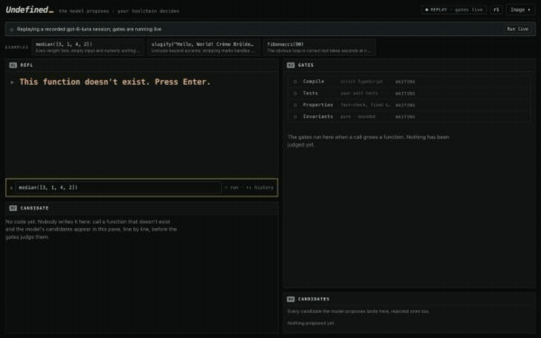

# Undefined

**A live program that grows the functions you call but haven't written. The model proposes; your toolchain decides.**



[Watch the 30-second demo](docs/demo.mp4) (2880×1800 MP4: the opening sequence, then the data scratchpad: load a dataset, call a function over it with no spec, get a table, pin the result as a test).

Compilers used to sit upstream of everything: a human wrote code, the compiler judged it. LLMs invert that pipeline. The
model becomes the *upstream source* of code, and the ordinary toolchain (a strict TypeScript compiler, unit tests,
property tests, purity and runtime-bound checks) becomes the *downstream consumer* that decides what is accepted. Undefined
makes that inversion visible: call a function that doesn't exist, watch a model draft it, and watch real gates (not
string checks) reject the first attempt with a concrete counterexample before the retry is committed as a numbered
revision of your running program. Everything runs in your browser except the model call, which goes through your local
[Codex CLI](https://github.com/openai/codex).

> **You didn't write this. The model wrote it. Your tests hold the contract, and your toolchain enforced it.**

## Run it

**Prerequisites:** Node `^20.19 || >=22.12` (Vite 8's floor; typecheck, 1126 tests and the build were run on Node 20.20, 22.23 and 26.8; older 20.x releases fail Vite's own engine check), [Codex CLI](https://github.com/openai/codex) 0.157 or later (`npm i -g @openai/codex`), and
`codex login` completed. No API keys, no cloud backend, nothing leaves your machine except the prompt to Codex.

```bash
git clone https://github.com/scasella/undefined.git && cd undefined
npm install
npm run dev          # opens on http://localhost:5173 with the generation service running (LIVE mode)
```

**Replay mode (no Codex needed):** `npm run build` produces a static site in `dist/` (deployable to GitHub Pages; assets
use relative paths). With no generation service reachable the app replays recorded `gpt-6-luna` sessions: *"Replaying a
recorded gpt-6-luna session; gates are running live."* The candidates are recorded; **every gate still executes live in
your browser** against them. `npm run preview` serves the build locally. A "Run live" button explains how to switch.

```bash
npm test             # unit + integration tests (Node)
npm run typecheck
```

## What you can do

- **Call anything.** Type `slugify("Hello World")` with no setup: the signature is inferred from your real arguments, only
  *Compile* and *Invariants* gate it, and the UI says so ("no tests yet, add one to make the gate stricter").
- **Four one-click examples** (the first three are specs where a rejection happens naturally, see below; the fourth, `orders`, is the data scratchpad with no spec at all): `median`, `slugify`, `fibonacci`, `topCustomersByRevenue(rows)`.
  Each has a **Break it** button that edits the spec: the artifact's hashes no longer match, it is marked invalid, and the
  next call regenerates it.
- **It will say no.** A call that needs the clock, randomness, the network, files or hidden state cannot be a pure
  function, and a name like `clean` or `process` says nothing about what it should do. Rather than commit a stub with a
  green tick, the model can decline, and the REPL says why and what to do (pass the randomness in as an argument; write a
  one-line spec). A decline commits nothing. `docs/HOSTILE.md` has the 54 stranger-style calls behind this.
- **Revisions.** Every accepted change is a numbered revision of the whole program *and its live state* (REPL variables).
  One click rolls back; rollbacks are themselves revisions, so history is never rewritten.
- **Hot reload.** Accepted functions are swapped into the running sandbox worker without a restart and without touching
  your REPL variables.
- **Structured recovery.** If a committed function throws, the REPL offers restarts: retry with the error fed back to the
  model, roll back, or edit the spec. Never a crash.
- **Export / import** your whole program (revisions, specs, artifacts, provenance) as one JSON file. State persists in
  IndexedDB.

## Data scratchpad

Press **Data** in the header to paste or drop CSV, TSV, JSON or JSON Lines (`.csv .tsv .json .jsonl .txt`). The file is
read in your browser, parsed, and its columns typed (numbers, booleans; empty cells become `null`). The preview shows the
row count, each column's type, the declared `type Row = {…}` and the first 20 rows. **Load** binds the rows to a REPL
variable (`rows` by default) as a revision. Rows are stored once, by content hash, in IndexedDB and in exported images,
and come back with rollback like any other variable. Limits: 20,000 rows and 1 MB.

Then call a function that does not exist on it, e.g. `topCustomersByRevenue(rows)`. The parameter is typed `Row[]`, the
type declaration is compiled in front of the function, and the gates replay the call on the real rows, frozen, so a
candidate that sorts `rows` in place is rejected.

**What is sent to Codex, and when.** Nothing is sent when you paste, preview or load. When a call that uses a dataset
grows (or regrows) a function in live mode, that prompt contains the variable name, the row count, the `type Row = {…}`
declaration and, while **Send 3 sample rows to Codex along with the type** is on (the default; your choice is
remembered), three rows spread across the data (first, middle, last), with long strings cut and at most 1.5 kB of JSON.
The drawer shows that exact text before you load anything. With the toggle off, only the type is sent. In replay mode
nothing is sent. No other row ever reaches the prompt.

**Pin as test.** Under a result, **Pin as test** turns the call and its result into a unit test on that function
(dataset arguments are stored by reference, not copied). Pins are outside both hashes, so pinning invalidates nothing.
The next regeneration must reproduce the pinned result, or the Tests gate rejects it and says that you pinned it.
Remove a pin in **Repo**.

The **orders** example binds a bundled, fictional `orders.csv` (332 rows) to `rows` and pre-types
`topCustomersByRevenue(rows)` with no spec. Only Compile and Invariants judge the result, so it is yours to judge: pin
it. Once the function exists, its **Break it** (in Repo) states what revenue means: refunds excluded, discounts applied,
rounded to cents. A recorded session ships for it (and for its *Break it*), so it replays on the static site too.

## How a call is decided

```
REPL call ──► runtime worker (name lookup is a Proxy scope) ──► name not defined
   │
   └─► grow loop (visible retry budget, default 3 candidates)
         prompt ─► codex exec (read-only, empty temp dir) ─► candidate body
         ┌─────────────────────────── gates (the toolchain decides) ───────────────────────────┐
         │ 1 Compile     strict TypeScript, lib ES2022 only (no DOM, no Node globals)             │
         │ 2 Tests       your unit tests, run in a Web Worker                                      │
         │ 3 Properties fast-check, fixed seed derived from the spec hashes, shrunk counterexample│
         │ 4 Invariants  pure (masked globals, frozen-argument replay, determinism) and            │
         │               bounded (per-call wall-clock budget; the worker is terminated on overrun) │
         └──────────────────────────────────────────────────────────────────────────────────────┘
         fail ─► diagnostic (file/line/message, or counterexample + expected vs actual) goes back to the model
         pass ─► new revision, hot-swapped into the running program, original call completes
```

Every decision shows who made it: which gate, which line or counterexample. A rejected candidate stays visible in the
candidate strip, so you can see the toolchain turning work away. If the budget runs out, the call fails cleanly and the
program is unchanged.

**What the model sees:** the signature, the doc, the *names* of your tests and properties (never their bodies or the
reference implementation), the time budget per call, the *types* of the triggering call's arguments (never the values),
and on retries the previous attempt plus structured diagnostics. Every candidate keeps the exact prompt it was generated
from: open *What the model saw* under the candidate (or in the Repo tab's candidate history) to read it, headed by a plain
summary of what was and was not sent. For replayed sessions that is the prompt stored in the recording (older recordings predate
the budget line, and the summary says only what their prompt contains). The gates know more than the model; that is the
point. When a failing check declares that the doc never covered the case, the rejection card says so: the spec was
silent, your tests decided, and the candidate's choice was defensible.

**Gate semantics worth knowing.** An invariant violation seen in *any* phase is reported by the Invariants gate. The
runaway candidate in `fibonacci` is killed while the Tests gate is running, so Tests and Properties show as "interrupted"
and Invariants shows the rejection with the exact call and the budget. Fast-check's seed is derived from the spec hashes,
so the same candidate always gets the same verdict and the same shrunk counterexample: the *gates* are deterministic; the
*model* is not.

**Provenance, not reproducibility.** Each artifact records its spec hash, tests hash, model id, Codex CLI version, and the
full candidate history including rejected attempts. Nothing here claims the model would produce the same code twice.

## How much to trust a committed function

Under the *Accepted — committed as rN* banner (and in the Repo tab's artifact card) is one muted line of facts
about what actually ran against the function, for example:

> Compiled. 4 tests passed. 3 rules held for 100 random inputs each. 26 calls re-run to look for side effects. Your
> checks caught 11 of 12 deliberately broken copies.

(In the UI the sentence is written in plain words like this; the precise terms, *properties*, *replayed on frozen
arguments*, *mutants*, are in its tooltip. The rest of this section uses the precise terms.)

It always lists the same five facts and says "no …" when one of them is zero: whether it compiled, the unit tests (and
pinned tests), the properties with their fast-check run counts, how many calls the Invariants gate replayed on frozen
arguments, and the mutation check. **It deliberately has no score, grade or percentage.** Counts of checks do not add up
to "how correct", and a single number would claim more than the gates know. The evidence is metadata attached to the
artifact after the fact. It is not part of any hash, so recording it never invalidates anything.

**Mutation testing** asks whether the checks actually check anything. Once the program has been idle for a few
seconds after a commit (never sooner than 10 s after you pressed Enter, and any new call or edit cancels it), up to 12
*broken copies* of the committed function are made. Each one changes one small thing in the compiled code, such as `<`
to `<=`, `+` to `-`, a constant `0` to `1`, or a condition negated. Every copy is run against the same tests,
properties and pins, with at most 1 s per call and a 6 s time box for the whole check. Each copy lands in one of four
buckets, which are reported separately and never merged:

- **killed**: a test or property failed.
- **stopped by the time limit**: a call did not return within the bound, as with an infinite loop. This is a kill,
  reported on its own.
- **survived**: every check accepted the broken copy. It *may be an equivalent mutant* (a change that makes no
  observable difference), so a survivor is a lead, not a verdict. "See what slipped through" lists each one as
  `line N of the compiled code: original → mutated`. N is a line of the compiled JavaScript body, not of the TypeScript the model
  wrote.
- **did not compile**: never run and never counted as a kill.

If the check cannot run at all (a broken copy fails to load, or the gate runner fails), it says *Mutation check could
not run: …* and counts nothing as killed. A function with no tests, properties or pins reads *No tests yet: nothing
could kill a mutant. Add one to make the gate stricter.* **Re-run the broken-copy check** in the Repo tab runs it again on
demand.

**More checks you can add.** When the function's name, types or doc suggest a property its spec does not state yet
(sorted output, same length, idempotence, round trips…), grey rows offer it with a one-line reason and an **Add**
button. Adding one re-checks the *committed* function against the strengthened spec, using its stored body and the new
seed. If it passes, the function is **re-certified in place**: the hashes are restamped, it stays live, nothing is
regenerated, and the log says *re-certified at rN: Added check "…"*. If it fails, the spec change stands, the function
goes stale (it regenerates on the next call), and the gate panel shows the counterexample. "Same input twice gives the
same result" and "The arguments are not modified" are listed as *already checked*: the Invariants gate runs both on
every candidate, so they are never offered. The shipped median, slugify and fibonacci specs already state everything
the suggester knows, so they get no suggestions. That is expected.

**Measured kill rates of the shipped checks**: the engine's own path, run on each known-good body in `src/examples`
(seed derived from the spec hashes, default 6 s box; printed by `src/core/engine.evidence.test.ts`, which runs in
Node, where there is no watchdog):

| example | body | result |
|---|---|---|
| median | goodBodies[0] | killed 11 of 12 (1 survived: compiled line 1, `0 → -1`) |
| median | goodBodies[1] | killed 11 of 12 (1 survived: compiled line 1, `0 → -1`) |
| slugify | goodBodies[0] | killed 1 of 1 (the body has a single mutation site) |
| slugify | goodBodies[1] | killed 12 of 12 |
| fibonacci | goodBodies[0] | killed 12 of 12 |
| orders | (spec-less) | no tests yet: nothing could kill a mutant |

In the browser, replaying the shipped recordings from the production build with the real watchdog (`node
scripts/mutation-check.mjs`, measured after the final re-record), the app itself reads: median 12 of 12, slugify 1 of 1,
and fibonacci 11 of 12 (two of them stopped by the time limit; one survived). These belong to the recorded bodies and change
when the recordings are re-made.

## The examples: who held the contract (read this)

`gpt-6-luna` is a strong model, and with a fully specified ticket it passes first time: in my first sampling, **18 of 18**
attempts at tightly specified versions of these examples passed every gate on the first try. So a demo of rejection cannot
claim the model "blundered". Each example is built so that the *reason* for the rejection is plain on screen, and the
rejection card says which kind it is:

- **The spec was silent and your tests decided.** The check carries a marker saying what the doc never said, and the card
  reads "The spec didn't say what the median of nothing is. Your tests did." plus a line saying the candidate's choice was
  defensible. The marker can carry a condition on the *shrunk counterexample*, so a real bug elsewhere in the same check
  is never labelled a spec gap.
- **The spec stated it and the candidate broke it** (compile errors, the time limit, a mutation of the arguments).

The model sees the signature, the doc, the *names* of your checks, and the time budget; never the bodies of the tests or
properties (tests are the contract, not a hint sheet). The "What the model saw" panel under every candidate shows the exact
prompt, and what was withheld.

| example | the one sentence a skeptic needs | what rejects it | measured over 8 full sessions: first candidate rejected → committed within 3 attempts |
|---|---|---|---|
| `median` | A median of nothing has no right answer: throwing, `NaN`, `0` and `undefined` are all defensible and the doc ("Returns the median of a list of numbers.") never says which, so when the tests say `NaN` the contract is speaking, not the model failing. | Properties (fast-check generates `[]` and shrinks to it): `median([]) threw Error…, expected NaN` | 8/8 → 8/8 |
| `slugify` | Whether an apostrophe splits a word, what `&` becomes and how `ß` is spelled are conventions the doc ("Turns a title into a URL slug.") never states; our tests state ours, and each of those rejections is labelled "the spec didn't say". | Tests: `slugify("Don't Stop") returned "don-t-stop", expected "dont-stop"` (or `Straße`/`stra-e`) | 6/8 → 7/8 (2 sessions passed first time; 1 ran out of attempts) |
| `fibonacci` | The doc states the range (n up to 1,000,000) and the prompt states the 1.5 s limit; the model wrote an O(n) loop it never timed (about 4 s at that n), so the fault is the candidate's and nothing was withheld. | Invariants (bounded): `fibonacci(1000000) did not return within 1500 ms` | 6/8 → 7/8 (2 sessions passed first time with fast doubling; 1 ran out of attempts) |
| `topCustomersByRevenue(rows)` | There is no spec and no test, so nothing can reject it: the claims are only that it compiles, is pure and replays on the real rows. The model's own note states its assumptions (here: revenue after discount, refunded orders counted) and the result is yours to judge; pin it to make it a test, or use *Break it* to say refunded orders don't count. | none (spec-less: Compile and Invariants only) | 8/8 committed on the first candidate |

Measured 2026-10-04 with `gpt-6-luna`, effort `low`, Codex CLI 0.159.2, as 8 complete sessions per example through the real
app (`node scripts/sessions.mjs`: real Worker watchdog, the real 3-attempt budget). These are one day's rates for one model,
not a guarantee. They are lower than my earlier single-retry sampling (8/8 for all three), which is why I quote
session-level numbers: the model sometimes passes first time (2 of 8 slugify and fibonacci sessions) and sometimes runs out
of attempts (1 of 8 each). The shipped recordings are real sessions captured by `npm run record`, which keeps a session only
if its first candidate was rejected and prints how many tries that took (median 1, slugify 1, fibonacci 2).

Models also fail in ways nobody tuned: in one live `slugify` run the first candidate came back with a literal `\n` in place
of a newline and the compiler rejected it ("Invalid character"), which is exactly the kind of thing the compile gate is for.

Where the idealised story differs: the `median` rejection is the empty list (shrunk by fast-check), not `median([1, 2])`
returning `1`, because this model gets the textbook cases right; and the fibonacci rejection is a slow-but-correct loop, not
naive recursion, because the model never wrote the recursion.

## Replay mode and recordings

Every session is recordable: **Image → Share this session…** saves a JSON file of the model candidates with their
prompts and progress lines (see *Share a session* below). Recordings in `public/recordings/` are matched by function name + spec hash + tests hash, so
replay works for the unmodified examples and for their **Break it** edits. Edit a spec to something that was never
recorded and replay mode says so, and tells you how to run live.

Maintainers re-record the shipped sessions with `npm run record` (starts the dev server, drives headless Chrome through the
real app against your Codex login, and writes `public/recordings/*.json`; it keeps a session only if the first candidate
was rejected and prints how many tries that took). `npm run check:replay` serves the production build with no backend and
checks that each example replays from its recording through the real UI.

## Share a session

**Image → Share this session…** works on the static site as well as in live mode, because a session you *replayed* is
shareable too. Three steps:

1. **Download the recording** (`undefined-session.json`). It holds every candidate generated in this page load: live
   ones as generated, replayed ones exactly as they were recorded, credited to the model, Codex version and effort that
   really wrote them (a replayed session is never marked live; a file that mixes both puts the other model on its own
   sessions). The recording includes your spec and test code and any dataset rows used in the session, with the prompts,
   candidates and the calls you typed; nothing else. Nothing generated yet: the dialog says so.
2. **Host it** anywhere that serves the raw file with CORS: a GitHub gist's **Raw** URL or `raw.githubusercontent.com`
   both work (a `github.com/…/blob/…` or `gist.github.com/<user>/<id>` page URL is turned into its raw URL for you).
3. **Paste that URL** into the dialog and copy the link it builds: `<this site>?recording=<url>`.

Someone who opens the link is asked first; nothing loads or runs on its own. The page fetches that one URL (besides its own files, the
only request the page ever makes other than to the local generation service in live mode), validates it, and shows what it holds: the
functions with their test and property counts, the number of calls, datasets, the model / CLI / date, anything that will
be skipped and why, and the plain warning *"This recording includes test code written by someone else. It runs in the
sandbox like any spec you write."* A link that fails to load shows the error and the CORS hint.

The same confirmation appears when you **drop a .json file anywhere on the page** (a recording and an exported program
image are told apart by their `format`; an image imports exactly as **Import image…** does) or use **Image → Load a
recording…** (a file picker and a URL field). **Load** adds the recording's specs and datasets (bound to their variable
names) as one revision, *Loaded recording: <title>*, registers its candidates so they replay by hash even when the live
service is up (anything it does not cover goes to the normal generator), types its first call into the REPL, and shows a
dismissible banner: *Replaying a recorded session from <source>: press Enter to run its calls; the gates run live in
your browser.* Each Enter on a recorded call types the next one in. What is checked before anything loads: every
session's spec must hash to what its candidates were recorded under and have a growable name, and every dataset's rows
must hash to their content address and fit the data limits; failures are listed and skipped. A spec of the same name in
your program is replaced (the dialog says so; roll back to undo). An older (version 1) recording that carries only hashes
replays only when you already have the matching spec, for example a shipped example; otherwise the dialog says there is
nothing it can replay. Loaded candidates last for the page load; the specs stay in your program.

## Local session log

**Image → Session log (this browser only)** is off by default. Turned on, it keeps a short log of what you type and what
the gates decided, in this browser's storage only (IndexedDB database `undefined-session-log`, memory if that is
blocked); it is never sent anywhere. Each entry is small: REPL inputs, the kind of outcome (never the value), which gate
rejected a candidate with its headline, declines, commits, pins, rollbacks, spec edits, dataset loads (name, row and
column counts only) and errors. It never holds prompts or dataset rows. The dialog shows the entry count, **Export log**
(`undefined-session-log.json`) and **Clear**; turning it off stops new entries and keeps the old ones until you clear
them. At most 5,000 entries are kept (oldest dropped first).

## The generation service

A small Vite dev-server middleware (`server/`), absent from the static build: `GET /generate/health`, `POST /generate`
(server-sent events). One `codex exec` per request, serialised, in an empty temp directory:

```
codex exec - --model gpt-6-luna --sandbox read-only --skip-git-repo-check --ephemeral --ignore-user-config \
  -C <empty tmp dir> --output-schema <{body,notes}> -o <tmp file> --json -c model_reasoning_effort=low
```

The service does nothing else: no compiling, testing, or caching. It kills the whole process group on timeout or client
disconnect, streams Codex's progress to the browser, and returns structured errors the gate panel displays with the fix
(`npm i -g @openai/codex`, `codex login`). It only answers same-host requests. Environment overrides:
`UNDEFINED_MODEL`, `UNDEFINED_EFFORT` (default `low`; your own Codex config may default to something much slower),
`UNDEFINED_TIMEOUT_MS`, `UNDEFINED_CODEX_BIN`.

Codex returns its answer in one piece, so "typed out as it arrives" is a typewriter over the received candidate; the live
progress lines above it (session started, turn started, tokens) are real Codex events.

## Limits and known gaps

- **The sandbox is a Web Worker, not a security boundary.** Candidate code runs with the clock, `Math.random`, network,
  timers and the global object shadowed by trapping proxies, and network/storage APIs are removed from the worker scope. A
  determined program could still reach the worker's global through `Function`-constructor tricks; the model is not
  adversarial and these checks exist to catch accidental impurity and make the decision visible.
- **REPL lines** are one expression or one binding (`x = …`, `const x = …`); no destructuring or multi-statement lines.
  After a function grows, the original line is re-evaluated, so side effects that happened *before* the undefined call run
  twice.
- Generated functions are self-contained: they cannot call other generated functions.
- A self-recursive function with no declared return type cannot compile (TS7023); the engine allows one extra attempt and
  tells the model.
- No multi-tab coordination for IndexedDB. No async tests.
- Browsers with IndexedDB blocked fall back to in-memory state for the session.

## Layout

```
server/            Vite middleware: the codex generation service, dev-only recording save
src/core/          engine (orchestrator), program/revision model, IndexedDB store, generators (live, replay)
src/gates/         strict TypeScript compile gate (lazy-loaded compiler + libs), source wrapper
src/sandbox/       gate executor + worker + watchdog, REPL runtime worker, purity masking
src/shared/        prompt builder, value display/serialisation, hashing, type inference
src/examples/      median, slugify, fibonacci (+ known-good and known-bad candidates used by tests)
src/share/         loading a shared recording (text, URL, ?recording=);  src/sessionlog/  the opt-in local session log
src/ui/            Preact UI;  public/recordings/  recorded sessions;  docs/DESIGN.md  module contracts
scripts/           tune.tune.ts: samples the real model against the real gates (see below)
```

`TUNE_N=8 TUNE_EX=median,slugify,fibonacci npx vitest run -c scripts/vitest.tune.config.ts` re-measures the rejection
rates above against your own Codex login (results in `.tmp/tune-out.json`).

## A 60-second demo script

1. **0:00** Open the page. One line of copy: *"This function doesn't exist. Press Enter."* The REPL holds `median([3, 1, 4, 2])`.
   Press **Enter**.
2. **0:03** The REPL prints `ReferenceError: median is not defined`, then *Generating…* with live Codex progress lines and a
   timer. Point at the retry strip: attempt 1 of 3.
3. **0:10** Candidate #1 types into the code pane. The gate panel runs top to bottom: **Compile ✓**, **Tests ✓**, then
   **Properties ✗**. The large red headline names the gate and the shrunk counterexample: `median([]) threw Error: …,
   expected NaN`. *"The model didn't lose an argument with a person; a property check it never saw said no."*
4. **0:18** Candidate #2 appears, passes all four gates, and the verdict reads *Accepted — committed as r2*. The REPL
   prints `2.5` labelled **generated · revision 2**. Candidate #1 is still in the strip, in red.
5. **0:25** Press Enter on `median([9, 7, 1])`: `7`, instantly, labelled **cached artifact**, with the one-time line *"You didn't
   write this. The model wrote it. Your compiler and tests decided whether to keep it."*
6. **0:35** Click the **fibonacci** example, press Enter. Watch **Invariants** reject the first candidate for blowing the
   1.5 s bound, with the call and elapsed time on screen; the retry commits a fast-doubling version.
7. **0:50** Open **Repo → median**, press **Break it**. The artifact turns *invalid: spec changed*. Call it again and it
   regenerates.
8. **0:52** Click **orders** and press Enter (it replays from its recording; live mode generates it afresh). The model sees only `type Row` and three sample rows (the
   **Data** drawer shows exactly which). The result renders as a table; press **Pin as test**. From now on every
   regeneration of `topCustomersByRevenue` has to reproduce that result, or Tests rejects it.
9. **0:54** Back on the committed median, wait a few seconds: under the Accepted banner the confidence line fills in
   with the mutation check (the recorded median reads *Your checks caught 12 of 12 deliberately broken copies*). When something survives,
   **See what slipped through** shows the broken copy your checks let through. There is no score, only what ran.
10. **0:55** Open **Revisions** and click **Roll back to r2**. Then **Image → Export** to download your whole program.
11. **0:58** **Image → Share this session…**: download `undefined-session.json`, put it in a gist, paste the gist's Raw URL
    and copy the `?recording=` link. Whoever opens it is asked first, then presses Enter to watch your session replay with
    the gates running live in their browser.
